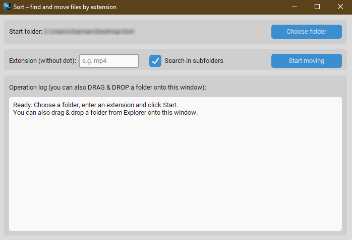

<div align="center">

# 📁 Sort – File Organizer by Extension  
A clean and lightweight desktop utility written in **Python + CustomTkinter**.  
Sort allows you to **quickly organize files by extension**, with built-in  
drag & drop support and optional subfolder scanning.



---

### Badges


</div>

---

## ✨ Overview

Sort is a small, fast and convenient desktop tool designed for photographers, video editors, and anyone who works with large batches of files.  
The application scans a folder for files with a specific extension (e.g., `.jpg`, `.mp4`, `.cr2`) and moves them into a dedicated subfolder — keeping everything tidy.

Thanks to **drag & drop support**, you can simply drop any folder onto the window and Sort will use it as the starting directory.

---

## 🔥 Key Features

- **Drag & Drop folders directly into the window**  
- Search for files **by extension** (no dot needed)  
- Optional **recursive mode**  
- Automatically creates destination folder  
- Modern UI using CustomTkinter  
- System light/dark theme detection  
- Custom app icon (`sort.ico`)  
- Buildable as a **single-file EXE**  
- MIT licensed and fully open-source  

---

## 🧩 Installation

### 1. Install Python (3.10 or newer)

Download from:  
https://www.python.org/downloads/

Ensure **“Add Python to PATH”** is enabled during installation.

---

### 2. Install dependencies

```bash
pip install customtkinter tkinterdnd2
```

`tkinterdnd2` provides native drag & drop on Windows.

---

## ▶️ Running the Application

```bash
python Sort.py
```

---

## 🛠️ Building a Windows EXE

First install PyInstaller:

```bash
pip install pyinstaller
```

Make sure `sort.ico` is in the same folder as your script.

Then build the EXE:

```bash
pyinstaller --onefile --windowed --icon=sort.ico --add-data "sort.ico;." Sort.py
```

Your executable will appear in:

```
dist/Sort.exe
```

---

## 📂 Example Workflow

1. Drag & drop a folder into the window  
2. Enter an extension (examples: `mp4`, `jpg`, `raw`)  
3. (Optional) enable **Search in subfolders**  
4. Click **Start moving**  
5. Files will be moved into:  

```
<selected folder>/<extension>/
```

Example:

```
C:/Photos → C:/Photos/jpg/
```

---

## 📁 Project Structure

```
/
├── Sort.py                 # Main application
├── sort.ico                # Application icon
└── README.md               # This file
```

---

## 📄 License

This project is released under the **MIT License** — free for personal and commercial use.

---

<div align="center">

Made with ❤️ for fast and simple file management.

</div>
